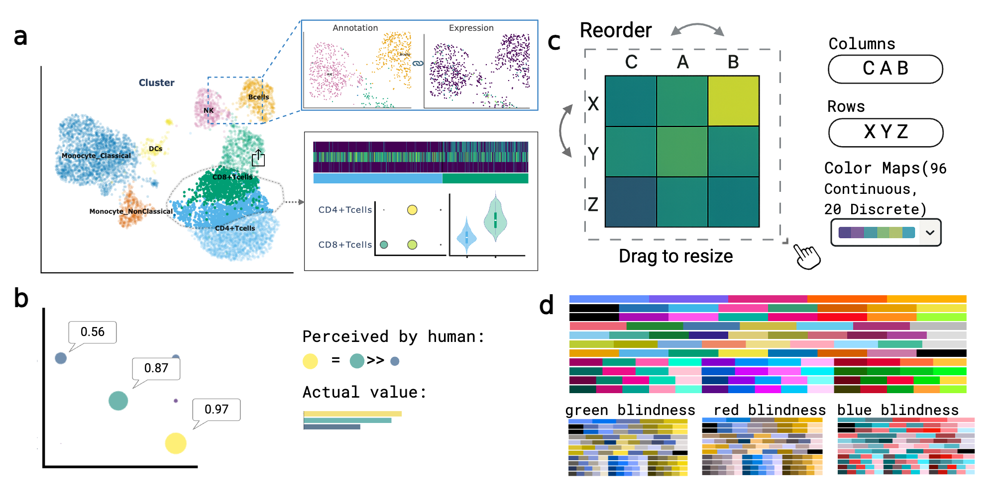

# GUANACO

<table border="0" cellspacing="0" cellpadding="0">
  <tr>
    <td width="120" align="center" valign="top">
      
    </td>
    <td style="padding-left: 20px;">
      <strong>GUANACO</strong> (Graphical Unified Analysis and Navigation of
      Cellular Omics) is a Python visualization platform for single-cell,
      spatial, and multi-omics data. It provides a browser dashboard and a
      general linked-view API for Python, Jupyter, and marimo.
    </td>
  </tr>
</table>

For a normal notebook figure, use the familiar Scanpy-style API:

```python
import guanaco as gc

gc.pl.umap(adata, color="cell_type")
```

The same function creates a plot specification when it receives `id=`:

```python
gc.pl.umap(id="cells", color="cell_type")
```

Both forms use the same GUANACO renderer, style, palette, transformations, and
plot defaults. `gc.pl.view()` exposes additional registered Plotly types.

## General linked views

Every linked plot uses the same model:

```text
selected mark  ->  row / cell / feature IDs  ->  detail plot
```

```python
workspace = gc.pl.linked_view(
    adata,
    views=[
        gc.pl.umap(id="cells", color="cell_type"),
        gc.pl.violin(
            id="expression",
            keys=["CD4"],
            groupby="cell_type",
        ),
    ],
    links=[gc.pl.link("cells", "expression")],
)

workspace.show_jupyter(port=8060, height=620)
```

The complete link API is:

```python
gc.pl.link(source, target, *, by=None, action=None, key=None)
```

Defaults are intentionally small:

- `AnnData → AnnData`: link `obs_names` and highlight selected cells.
- `DataFrame → DataFrame`: link the index and filter the detail.
- Cross-container: declare `by="cell"` or `by="feature"`; an optional `key`
  maps table rows to AnnData `obs_names` or `var_names`.
- `action="filter"` removes unselected cells; `highlight` keeps them as context.
- Feature links need no action; the selected feature becomes the target's
  color, key, or feature set.

The four supported data cases are AnnData cells, AnnData features, an external
cell/feature-indexed table with AnnData, and two external indexed tables.
External data should be an atomic long/tidy DataFrame: a stable unique index
and one row per smallest retrievable record. An aggregated network edge or
heatmap tile keeps the indices of all rows it represents.

For one-to-many table links, `key` names a shared logical parent column. The
atomic DataFrame index stays unique, while repeated values such as `pair_id`
allow one overview row to update many spot or curve rows:

```python
gc.pl.link("neighborhoods", "locations", key="pair_id")
gc.pl.link("neighborhoods", "cooccurrence", key="pair_id")
# a table of spatial memberships can drive a native spatial AnnData view
gc.pl.link("neighborhoods", "spatial", by="cell", key="cell_id", action="filter")
```

Links are overview → terminal detail. One overview can update several details
and several overviews can update one detail; details are zoom-only and never
become new sources.

Jupyter and marimo are both supported. After interacting, rerun a notebook
cell to retrieve the stable IDs:

```python
selection = workspace.get_selection("cells")
print(selection.ids if selection else ())
```

See the [linked-view guide](docs/linked_views.md) for all four data cases and
the [runnable notebook](examples/notebooks/Linked_views_demo.ipynb) for demos.

## Full GUANACO dashboard

The declarative API complements GUANACO's complete browser dashboard, which
includes dimensionality reduction, heatmaps, violin/ridge plots, dot and matrix
plots, composition, pseudotime, genome browsing, spatial visualization, free
cell selection, color-map controls, and interactive layouts.



[Launch the hosted interactive demo](https://guanaco-demo.chen-sysimeta-lab.com/)

Create a minimal dashboard configuration:

```json
{
  "Demo": {
    "sc_data": "/absolute/path/to/PBMC_int.h5ad"
  },
  "settings": {
    "port": 4399,
    "max_cells": 10000,
    "backed_mode": false,
    "embedding_render_backend": "scattergl"
  }
}
```

Then run:

```bash
guanaco -c config.json
```

To create the configuration with a GUI:

```bash
guanaco --config-wizard -c /absolute/path/to/guanaco.json
```

## Installation

Python compatibility: `>=3.11,<3.15`.

```bash
pip install guanaco-viz
pip install "guanaco-viz[notebook]"  # Jupyter + marimo support
```

### Reproducible development environment with Pixi

```bash
git clone https://github.com/Systems-Immunometabolism-Lab/guanaco-viz.git
cd guanaco-viz
pixi install
pixi run install-dev

pixi run test
pixi run lint
pixi run build
```

## Documentation

- [Linked-view concepts and extension API](docs/linked_views.md)
- [Interactive linked-view notebook](examples/notebooks/Linked_views_demo.ipynb)
- [Complete user guide](https://systems-immunometabolism-lab.github.io/guanaco-viz/)

## License

GUANACO is distributed under the GNU General Public License v3.0. See
[LICENSE](LICENSE).

## Citation

If you use GUANACO in your research, please cite:

> **Zhang X, Kuddus M, Xia Q, Hu Y, Chen P.**  
> *GUANACO: A Unified Web-Based Platform for Single-Cell Multi-Omics Data Visualization*  
> bioRxiv 2025.09.18.677070;
> [https://doi.org/10.1101/2025.09.18.677070](https://doi.org/10.1101/2025.09.18.677070)

The citation will be updated after peer-reviewed publication.
