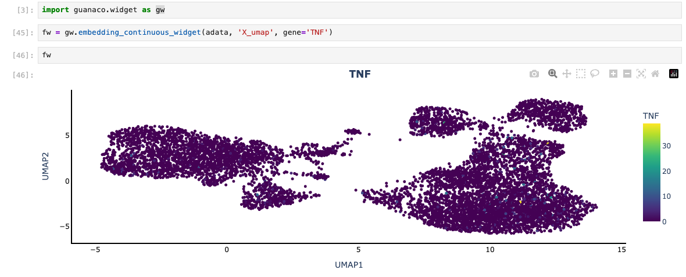

# GUANACO Plotly Widgets

This folder contains example notebooks demonstrating the FigureWidget-based
APIs built on top of GUANACO's plotting functions.

## Quick Start

Open the example notebook in this folder and run cells. For instance:

```python
from guanaco.widget import embedding_continuous_widget
fw = embedding_continuous_widget(adata, 'X_umap', gene='TNF')
fw  # renders interactively in Jupyter
```

## Notes

- The widget wrappers live in `guanaco/widget.py` and return `plotly.graph_objects.FigureWidget`.
- The underlying plotting code remains in `guanaco/pages/matrix/cellplotly/*`.

## Widget API

Each function returns a `go.FigureWidget` wrapping an existing GUANACO plot.

- embedding_continuous_widget(adata, embedding_key, gene, x_axis=None, y_axis=None, transformation=None, order=None, color_map='Viridis', marker_size=5, opacity=1.0, annotation=None, axis_show=True): Plot a continuous feature (e.g., single gene expression) on an embedding.

- embedding_categorical_widget(adata, embedding_key, color, x_axis=None, y_axis=None, color_map=None, marker_size=5, opacity=1.0, legend_show='on legend', axis_show=True): Plot categorical labels with a fixed color map across categories.

- embedding_coexpression_widget(adata, embedding_key, gene1, gene2, threshold1=0.5, threshold2=0.5, x_axis=None, y_axis=None, transformation=None, marker_size=5, opacity=1.0, legend_show='on legend'): Categorize cells by co-expression of two genes and plot on an embedding.

- embedding_continuous_annotation_widget(adata, embedding_key, annotation, x_axis=None, y_axis=None, color_map='Viridis', marker_size=5, opacity=1.0, axis_show=True): Plot a continuous annotation from `adata.obs` on an embedding.

- heatmap_widget(adata, genes, groupby1, groupby2=None, labels=None, log=False, z_score=False, boundary=False, color_map='Viridis', groupby1_label_color_map=None, groupby2_label_color_map=None, max_cells=50000, n_bins=10000, transformation=None, adata_obs=None): Unified expression heatmap grouped by categorical annotations; supports log/z-score transforms and optional binning.

- violin1_widget(adata, genes, groupby, labels=None, transformation=None, show_box=False, show_points=False, groupby_label_color_map=None, adata_obs=None): Violin plots of gene expression split by a categorical annotation.

- violin2_widget(adata, key, meta1, meta2, mode, transformation=None, labels=None, color_map=None): Alternative violin/box configuration (e.g., split by two metas) with sensible defaults.

- dotmatrix_widget(adata, genes, groupby, labels=None, color_map='Viridis', transformation=None, plot_type='dotplot', cluster='none', method='average', metric='correlation'): Dot or heatmap-style summary of expression per group; optional clustering controls.

- stacked_bar_widget(adata, x_meta, y_meta, norm='prop', color_map=None, y_order=None, x_order=None): Stacked bar chart of category composition (or histogram when `x_meta == y_meta`).

- pseudotime_widget(adata, genes, pseudotime_key='pseudotime', groupby=None, min_expr=0.5, transformation='none', color_map=None): Gene expression trends across pseudotime with optional grouping.

### Minimal examples

```python
import guanaco.widget as gw
# Continuous gene on UMAP
fw1 = gw.embedding_continuous_widget(adata, 'X_umap', gene='TNF')

# Heatmap across clusters
fw2 = gw.heatmap_widget(adata, genes=['TNF','IL7R'], groupby1='Cluster')

# Violin by condition
fw3 = gw.violin1_widget(adata, genes=['TNF'], groupby='Dataset')

# Dot matrix by cluster
fw4 = gw.dotmatrix_widget(adata, genes=['TNF','IL7R'], groupby='Cluster')

# Stacked bar of condition within cluster
fw5 = gw.stacked_bar_widget(adata, x_meta='Cluster', y_meta='Dataset', norm='prop')
```

Example screenshot:



The full example is in provided in Widget_example.ipynb.
